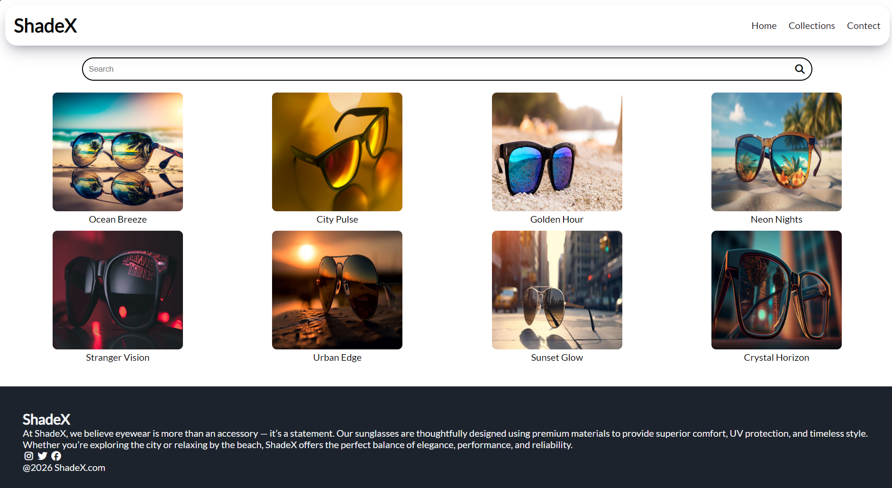
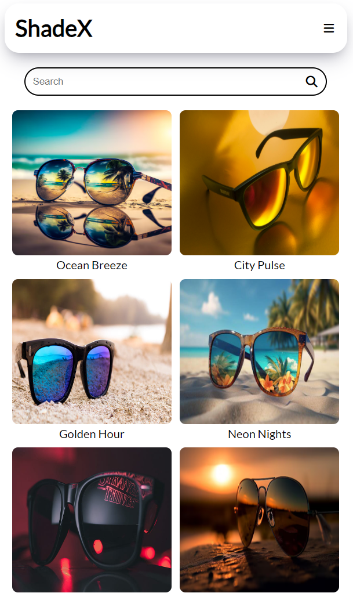
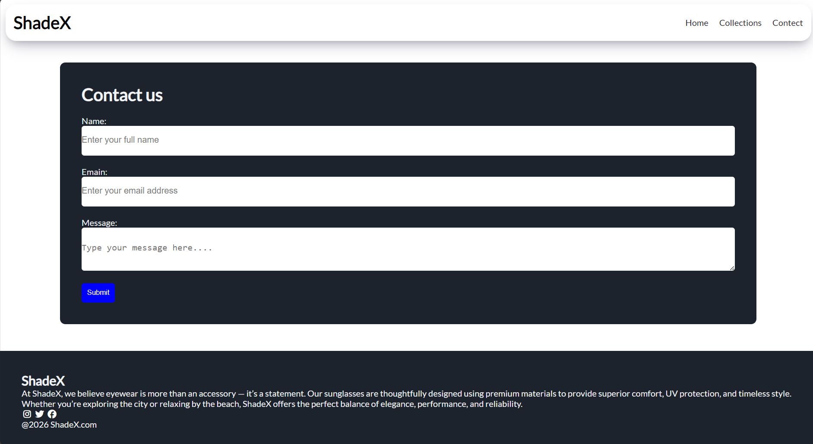
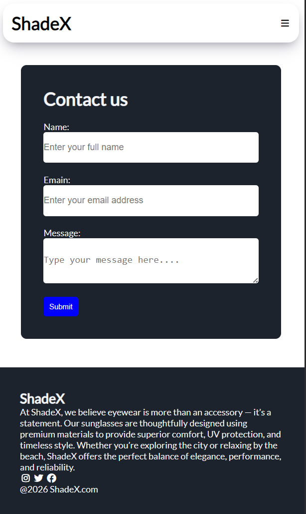

# ShadeX Sunglasses Store

A responsive front-end project with three pages:
- Landing page with promo and newsletter signup
- Product catalog with multiple sunglasses styles
- Contact form with name, email, and message fields

## Features
- Responsive design (works on desktop and mobile)
- Sidebar navigation
- Clean UI with catalog and contact form
- Organized project structure

## Screenshots

### Landing Page
**Desktop View**
.png)
.png)

**Mobile View**
.png)
.png)

### Product Catalog
**Desktop View**

**Mobile View**

### Contact Form
**Desktop View**

**Mobile View**

## How to Run
- Open index.html in your browser.
